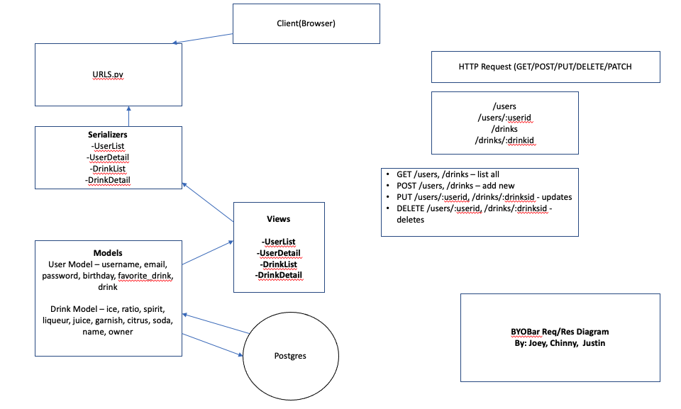

# BYOBar - Backend

> This is the backend repo for our App, "BYOBar". Using Python, Django, Postgres, and AWS, we created a full CRUD app where users can create drinks, share their ideas, and comment on their favorite cocktails!

## API Routes

### Root Route

https://buildyobar.herokuapp.com/

### Route paths

| Method | Route            | Description            |
| ------ | ---------------- | ---------------------- |
| GET    | /                | Read all drinks        |
| POST   | /drinks          | Create drink\*         |
| PUT    | /drinks/:drinkid | Update entire drink\*  |
| PATCH  | drinks/:drinkid  | Update partial drink\* |
| DELETE | drinks/:drinkid  | Delete drink\*         |

\* Note: User must be logged in to complete routes

## Technologies / Dependencies Used

- PostgresSQL
- Django
- pipenv
- Python / iPython
- AWS
- Django REST Framework
- cors
- boto3
- Djoser
- whitenoise
- gunicorn
- Heroku

## Installation

1. Fork and clone this repository to your machine
2. `cd` into the repo
3. Create your shell with `pipenv shell`
4. Install dependencies with `pipenv install`
5. Open code editor with `code .`

## Contribution Guidelines

### How to identify bugs

> If you identify bugs, submit an issue on the Git repo. Please detail the bug in your issue. If you know how to fix it, feel free to note the methods you would use. You could also submit a pull request with suggested code to fix it.

### Models and Properties

#### Updated Drink Model

```
class Drink(models.Model):
    name = models.CharField(max_length=100, default='no name')
    ice = models.CharField(max_length=100, default='no ice')
    spirit = models.CharField(max_length=100, default='no spirit')
    liqueur = models.CharField(max_length=100, default='no liqueur')
    juice = models.CharField(max_length=100, default='no juice')
    garnish = models.CharField(max_length=100, default='no garnish')
    citrus = models.CharField(max_length=100, default='no citrus')
    soda = models.CharField(max_length=100, default='no soda')
    special_request = models.TextField(null=True, blank=True)
    photo = models.ImageField(
        upload_to='images/', default='images/drank.jpg')
    owner = models.ForeignKey(
        'users.User', related_name='drinks', on_delete=models.CASCADE)

    def __str__(self):
        return self.name
```

#### Updated Comment Model

```
class Comment(models.Model):
    title = models.CharField(max_length=100)
    drink = models.ForeignKey(
        Drink, on_delete=models.CASCADE, related_name='comments')
    body = models.TextField()
    owner = models.ForeignKey(
        'users.User', related_name='comments', on_delete=models.CASCADE)

    def __str__(self):
        return self.title
```

### Initial Req. / Res. Cycle Diagram



### Planning

https://trello.com/b/q1Q4pewQ/byob

### Unsolved Problems / Major Hurdles

> The biggest hurdle was getting used to the new process of creating a backend. We previously used Express and MongoDb which was a little more forgiving. Once we were able to work around proper naming conventions and successful migrations, we were on our way!

### Contributors

- Chinsan Lim (https://github.com/chinsan-lim)
- Joey Chang (https://github.com/joesphchang)
- Justin Lombardi (https://github.com/thejustinlombardi)
